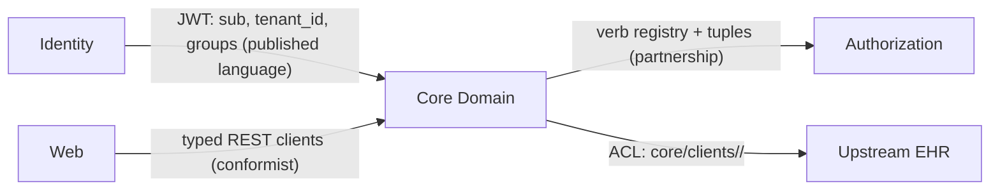

# Templates

Skeletons for the skill's outputs. Keep them tight — a template is a floor, not a form to pad.

## Glossary

One row per term. If the codebase has no glossary, producing this table is itself a review deliverable.

```markdown
| Term | Owning context | Definition (one line) | Synonyms found (where) | Status |
|---|---|---|---|---|
| Conference | Scheduling | One occurrence of a board's meeting series | "session" (web routes, dashboard types) | drift — pick one |
| Tenant | Account & Tenancy | A customer org; opaque id minted at onboarding | "Organization" (KC, SpiceDB, core registry) | managed — see ADR |
```

Status values: `agreed` · `drift — pick one` · `managed` (drift documented by ADR) · `open`.

## Context Map

Mermaid, one node per bounded context, edges labeled with the relationship type and the concrete contract artifact.



Edge labels name the relationship: `published language` · `conformist` · `customer/supplier` · `partnership` · `ACL` · `shared kernel` (suspect — justify it). If an edge has no nameable contract artifact, that is a finding.

## Brownfield Review Notes

One row per finding, ordered by the severity triage in [brownfield.md](brownfield.md).

```markdown
| # | Severity | Finding | Evidence (file:line) | Concrete failure | Smallest refactor |
|---|---|---|---|---|---|
| 1 | wrong now | Task.patient not validated against task.case.patient | tasks/api/serializers.py:29 | task displayed under wrong patient | derive patient from case, or model clean() + DB check |
| 2 | breaks on change | group names hardcoded in 3 repos | realm.json:76; settings/base.py:… | rename in identity silently breaks api+web | group-contract doc + CI name diff |
```

Close the notes with a short "clean enough to keep" list — patterns the next reader should not refactor away.

## ADR (minimal)

```markdown
# ADR-NNN: <decision>
Date · Status (proposed/accepted/superseded by NNN)

**Context** — the forces, in 2–4 sentences. Name the contexts/contracts involved.
**Decision** — one sentence, active voice.
**Consequences** — what gets easier, what gets harder, what becomes load-bearing.
```

Reserve ADRs for hard-to-reverse choices: boundary placement, contract shape, integration style, ownership transfer.
